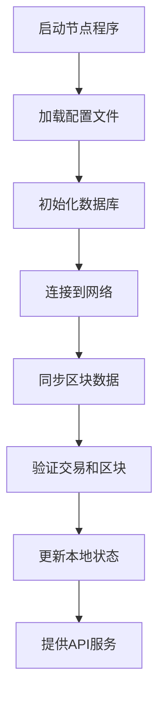

# 区块链节点完全指南

## 🎯 什么是区块链节点

### 节点的本质
- **节点是一个完整的软件程序**，不只是一段代码
- **是区块链网络的参与者**，连接到全球分布式网络
- **运行在计算机上的应用程序**，需要24/7持续工作
- **同步和维护区块链数据**，确保网络状态一致性

### 节点的组成结构
```
区块链节点 = 客户端软件 + 区块链数据库 + 网络通信模块 + API接口
```

#### 主要组件详解：
1. **客户端程序**：核心执行引擎，处理交易和区块
2. **区块链数据库**：存储完整的区块链历史数据
3. **网络通信模块**：与其他节点进行P2P通信
4. **API接口**：提供REST/RPC接口供外部查询

## 🔷 以太坊节点详解

### 获取以太坊节点软件

#### 方法1: 下载预编译版本
```bash
# 下载 Geth (Go-Ethereum)
wget https://gethstore.blob.core.windows.net/builds/geth-linux-amd64-1.13.5.tar.gz
tar -xzf geth-linux-amd64-1.13.5.tar.gz
cd geth-linux-amd64-1.13.5
```

#### 方法2: 包管理器安装
```bash
# Ubuntu/Debian
sudo apt-get update
sudo apt-get install ethereum

# macOS
brew install ethereum

# Windows
choco install geth
```

#### 方法3: 从源码编译
```bash
# 克隆源码
git clone https://github.com/ethereum/go-ethereum.git
cd go-ethereum

# 编译安装
make all
sudo make install
```

### 运行以太坊节点
```bash
# 基本启动
geth

# 快速同步模式 + HTTP API
geth --syncmode fast --http --http.api personal,eth,net,web3

# 完整配置示例
geth \
  --syncmode fast \
  --http \
  --http.addr "0.0.0.0" \
  --http.port 8545 \
  --http.api "personal,eth,net,web3,txpool" \
  --ws \
  --ws.addr "0.0.0.0" \
  --ws.port 8546 \
  --datadir ~/.ethereum \
  --cache 2048
```

### 以太坊客户端选择

| 客户端 | 语言 | 特点 | 官网 |
|--------|------|------|------|
| **Geth** | Go | 最流行，功能完整 | https://geth.ethereum.org/ |
| **Besu** | Java | 企业级，高度可配置 | https://besu.hyperledger.org/ |
| **Nethermind** | C# | 高性能，.NET生态 | https://nethermind.io/ |
| **Erigon** | Go | 高效存储，快速同步 | https://github.com/ledgerwatch/erigon |

## 🌌 Cosmos/FeiCoin 节点详解

### FeiCoin 节点构成
```bash
# 你已经在运行的就是 FeiCoin 节点！
ignite chain serve  # 启动 FeiCoin 节点
```

### 节点文件结构
```
~/.feicoin/
├── config/
│   ├── app.toml           # 应用层配置
│   ├── config.toml        # Tendermint 共识配置
│   ├── genesis.json       # 创世区块配置
│   └── node_key.json      # 节点网络身份
├── data/
│   ├── application.db     # 应用状态数据
│   ├── blockstore.db      # 区块存储
│   ├── evidence.db        # 作恶证据
│   └── state.db          # 共识状态
└── keyring-test/         # 测试环境密钥存储
```

### Cosmos SDK 节点命令
```bash
# 查看节点状态
feicoind status

# 查看节点信息
feicoind query node-info

# 查看连接的对等节点
feicoind query net-info

# 查看验证者集合
feicoind query tendermint-validator-set

# 启动节点（生产环境）
feicoind start --home ~/.feicoin
```

## 📊 节点类型对比

### 1. 全节点 (Full Node)
```
功能: 存储完整区块链数据，验证所有交易
存储: 500GB - 2TB+（以太坊主网）
网络: 需要稳定高速网络连接
用途: 完整验证，支持轻客户端
```

### 2. 轻节点 (Light Node)
```
功能: 只存储区块头，依赖全节点
存储: 几MB - 几GB
网络: 较低带宽要求
用途: 移动设备，快速同步
```

### 3. 验证者节点 (Validator Node)
```
功能: 全节点 + 参与共识
存储: 同全节点
网络: 极高可用性要求（99.9%+）
用途: 网络安全，获得奖励
```

### 4. 归档节点 (Archive Node)
```
功能: 存储所有历史状态
存储: 数TB+
网络: 超高带宽要求
用途: 区块链浏览器，数据分析
```

## 🔧 节点工作原理

### 节点启动流程


### 网络通信过程
1. **节点发现**：通过种子节点发现其他节点
2. **握手协议**：建立安全的P2P连接
3. **数据同步**：下载缺失的区块和交易
4. **状态验证**：验证接收到的数据正确性
5. **广播传播**：向网络广播新的交易和区块

## 🛠️ 实际操作指南

### 以太坊节点设置

#### 1. 硬件要求
```
CPU: 4核以上 (推荐8核)
内存: 16GB+ RAM (推荐32GB)
存储: 2TB+ SSD (快速增长)
网络: 25+ Mbps 上下行带宽
```

#### 2. 同步模式选择
```bash
# 快照同步（推荐）
geth --syncmode snap

# 快速同步
geth --syncmode fast

# 完整同步（最安全但最慢）
geth --syncmode full
```

#### 3. 监控节点状态
```bash
# 查看同步进度
curl -X POST -H "Content-Type: application/json" \
  --data '{"jsonrpc":"2.0","method":"eth_syncing","params":[],"id":1}' \
  http://localhost:8545

# 查看当前区块
curl -X POST -H "Content-Type: application/json" \
  --data '{"jsonrpc":"2.0","method":"eth_blockNumber","params":[],"id":1}' \
  http://localhost:8545
```

### FeiCoin 节点运维

#### 1. 开发环境
```bash
# 启动开发链
ignite chain serve

# 重置链状态
ignite chain serve --reset-once

# 指定配置文件
ignite chain serve --config config.yml
```

#### 2. 生产环境
```bash
# 初始化节点
feicoind init mynode --chain-id feicoin

# 启动节点
feicoind start --home ~/.feicoin

# 后台运行
nohup feicoind start --home ~/.feicoin > node.log 2>&1 &
```

#### 3. 节点维护
```bash
# 查看日志
tail -f ~/.feicoin/logs/node.log

# 备份关键文件
cp ~/.feicoin/config/priv_validator_key.json ~/backup/
cp ~/.feicoin/config/node_key.json ~/backup/

# 升级节点
# 1. 停止节点
killall feicoind
# 2. 替换二进制文件
cp new_feicoind /usr/local/bin/feicoind
# 3. 重启节点
feicoind start --home ~/.feicoin
```

## 💰 成为验证者

### 验证者 vs 普通节点

| 特征 | 普通节点 | 验证者节点 |
|------|----------|------------|
| **功能** | 同步数据，验证交易 | 参与共识，创建区块 |
| **质押** | 无需质押 | 需要质押代币 |
| **奖励** | 无奖励 | 获得区块奖励 |
| **惩罚** | 无惩罚风险 | 恶意行为被罚没 |
| **责任** | 低 | 高（网络安全） |

### 以太坊验证者要求
- **质押要求**：32 ETH (约$50,000-100,000)
- **硬件要求**：与全节点相同但更严格
- **网络要求**：99.9%+ 在线率
- **技术要求**：熟悉节点运维，监控告警

### Cosmos 验证者要求
- **质押要求**：灵活，通常几千到几万美元
- **硬件要求**：相对较低
- **网络要求**：稳定连接即可
- **技术要求**：中等，有丰富文档支持

## 🔒 安全和最佳实践

### 节点安全
1. **密钥管理**
   ```bash
   # 备份验证者密钥
   cp ~/.feicoin/config/priv_validator_key.json ~/secure_backup/
   
   # 设置文件权限
   chmod 600 ~/.feicoin/config/priv_validator_key.json
   ```

2. **网络安全**
   ```bash
   # 防火墙设置
   ufw allow 26656/tcp  # P2P端口
   ufw allow 26657/tcp  # RPC端口（谨慎开放）
   ufw allow 1317/tcp   # REST API（谨慎开放）
   ```

3. **监控告警**
   ```bash
   # 监控脚本示例
   #!/bin/bash
   HEIGHT=$(feicoind status | jq -r '.SyncInfo.latest_block_height')
   if [ "$HEIGHT" -gt 0 ]; then
     echo "Node is syncing, height: $HEIGHT"
   else
     echo "WARNING: Node may be stuck!"
   fi
   ```

### 运维最佳实践
1. **定期备份**：配置文件、密钥文件、数据库
2. **监控系统**：CPU、内存、磁盘、网络使用率
3. **日志管理**：定期清理和分析日志文件
4. **版本更新**：及时更新节点软件版本
5. **灾难恢复**：制定节点故障恢复方案

## 📚 学习资源

### 官方文档
- **以太坊**：https://ethereum.org/en/developers/docs/nodes-and-clients/
- **Cosmos SDK**：https://docs.cosmos.network/
- **Tendermint**：https://docs.tendermint.com/

### 实用工具
- **节点监控**：Prometheus + Grafana
- **密钥管理**：Vault, AWS KMS
- **部署工具**：Docker, Kubernetes, Ansible

### 社区资源
- **以太坊客户端对比**：https://clientdiversity.org/
- **Cosmos 验证者指南**：https://hub.cosmos.network/validators/overview
- **节点运营者社区**：Discord, Telegram 群组

## 🎯 总结

### 关键概念
- **节点是完整的区块链软件**，不只是代码片段
- **节点维护网络状态**，验证交易和区块
- **验证者是特殊的节点**，参与网络共识
- **运行节点需要持续的维护和监控**

### 开始步骤
1. **学习环境**：先在测试网练习
2. **硬件准备**：确保满足最低硬件要求
3. **软件安装**：从官方渠道获取客户端
4. **网络配置**：设置防火墙和端口转发
5. **监控告警**：建立完善的监控体系

### 发展路径
```
普通用户 → 运行节点 → 学习运维 → 成为验证者 → 网络贡献者
```

记住：**你已经在运行 FeiCoin 节点了**！(`ignite chain serve` 就是节点程序)

成为验证者本质上就是让你的节点从"观察者"变成"参与者"，从同步数据变成创造数据。

---

*本文档将持续更新，反映最新的技术发展和最佳实践。*